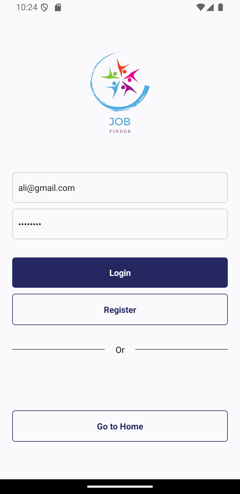
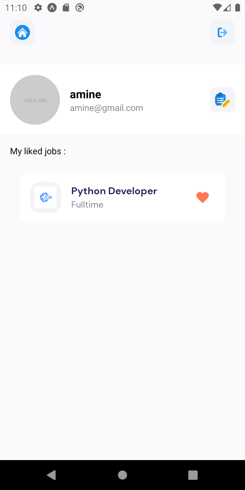

# job search app 

### screens 






***

### ⚙️ Tech Stack
React Native
firebase  
Axios
Expo
Stylesheet
***
### 🔋 Features
👉 Visually Appealing UI/UX Design: Develop an aesthetically pleasing user interface using React Native components.

👉 Third Party API Integration: Fetch data from an external API and seamlessly integrate it into the app.

👉 Auth and database: using Firestore and Firebase auth to manage user's authentication and store user's information and saved jobs.

👉 Search & Pagination Functionality: Implement search functionality and pagination for efficient data navigation.

👉 Custom API Data Fetching Hooks: Create custom hooks for streamlined and reusable API data fetching.

👉 Dynamic Home Page: Explore diverse jobs from popular and nearby locations across different categories.

👉 Browse with Ease on Explore Page: Page: Navigate through various jobs spanning different categories and types.

👉 Detailed Job Insights: View comprehensive job details, including application links, salary info, responsibilities, and qualifications.

👉 Optimized for All Devices: A responsive design for a seamless user experience across various devices.


👉  building APK with eas
To generate an APK without submitting it to the Google Play Store, you can follow these steps:

### Step 1: Install Expo CLI and EAS CLI
Make sure you have the Expo CLI and EAS CLI installed. If not, you can install them using the following commands:

```bash
npm install -g expo-cli
npm install -g eas-cli
```

### Step 2: Configure `eas.json`
Create or update your `eas.json` file to include a profile for building the APK. This file should be in the root directory of your project.

```json
{
  "build": {
    "production": {
      "android": {
        "buildType": "apk"
      }
    }
  }
}
```

### Step 3: Authenticate with Expo
Log in to your Expo account if you haven't already:

```bash
expo login
```

### Step 4: Build the APK
Run the following command to start the build process for your Android APK:

```bash
eas build --platform android --profile production
```

This command will start the build process on Expo's servers. Once the build is complete, you will get a link to download the APK.

### Step 5: Download the APK
After the build process completes, Expo will provide a URL to download the APK. You can access the link directly from the terminal output or from your Expo dashboard under the "Builds" section.

### Example of the Complete Workflow
1. **Install dependencies**:
    ```bash
    npm install -g expo-cli eas-cli
    ```

2. **Create or update `eas.json`**:
    ```json
    {
      "build": {
        "production": {
          "android": {
            "buildType": "apk"
          }
        }
      }
    }
    ```

3. **Login to Expo**:
    ```bash
    expo login
    ```

4. **Build the APK**:
    ```bash
    eas build --platform android --profile production
    ```

5. **Download the APK**:
   After the build is complete, download the APK from the provided URL in the terminal output or from your Expo dashboard.

